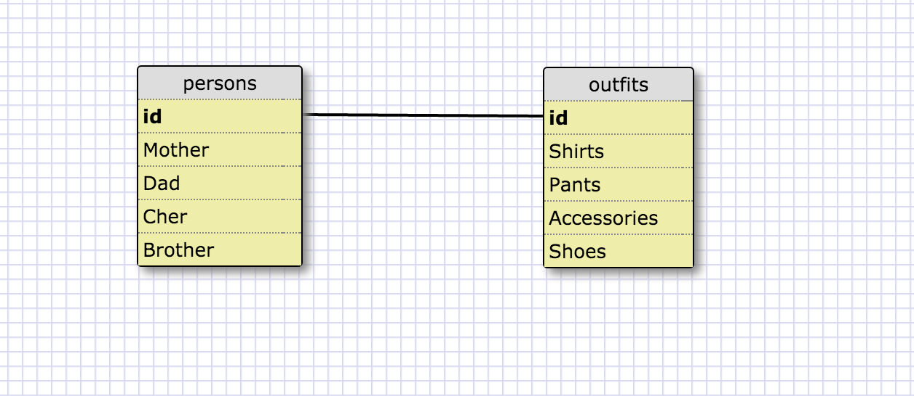

1.What are databases for?

1.Database are excellent in organizing information in the best, easy, accessible form. In today's internet world, everything is on computer and online. In order to make information pressing faster and efficient, we have to use databases to help us organize and access the data in the best way.

2.What is a one-to-many relationship?

2.‘One to many’ relationship means that, one nation has 50 states. It means that the Great state of California have so and so counties inside her. So there Was one state, but many countries .

3.What is a primary key? What is a foreign key? How can you determine which is which?

3.‘A primary key is a field in a table which uniquely identifies each row/record in a database table. Primary keys must contain unique values. A primary key column cannot have NULL values.’(SQL Primary Key - TutorialsPoint) So this means, that primary key is thee main key in helps us to identify   information in the table..’ SQL Foreign Key. 
A foreign key is a column (or columns) that references a column (most often the primary key) of another table. The purpose of the foreign key is to ensure referential integrity of the data. In other words, only values that are supposed to appear in the database are permitted.’(SQL - Foreign Key | 1Keydata). A foreign key helps us to validate information in the cells, to make sure it’s permitted.

4.How can you select information out of a SQL database? What are some general guidelines for that?

4.Well, the most important thing is to know how to write in the correct form, and when I say rather I mean to know when to Caps lock, and when do not. Beside this, this is most of the time straight forward, I won't say it’s difficult, it's just a different language that we need to be familiar in how to use. There aren't many tricky methods or complex function, because it is all thru the database accessibility. 

My solutions :

1.SELECT * FROM  states;
2.SELECT * FROM  regions;
3.SELECT state_name , population FROM states;
4.SELECT state_name , population FROM states ORDER BY population DESC;
5.SELECT state_name FROM states WHERE region_id=7;
6.SELECT state_name, population_density FROM states WHERE population_density>50 ORDER BY population_density ASC;
7.SELECT state_name FROM states WHERE population BETWEEN 1000000 AND 1500000;
8.SELECT state_name , region_id FROM states ORDER BY region_id ASC;
9.SELECT region_name FROM regions WHERE region_name LIKE "%Central";
10.SELECT region_name, state_name FROM regions, states ORDER BY region_ID ASC;

