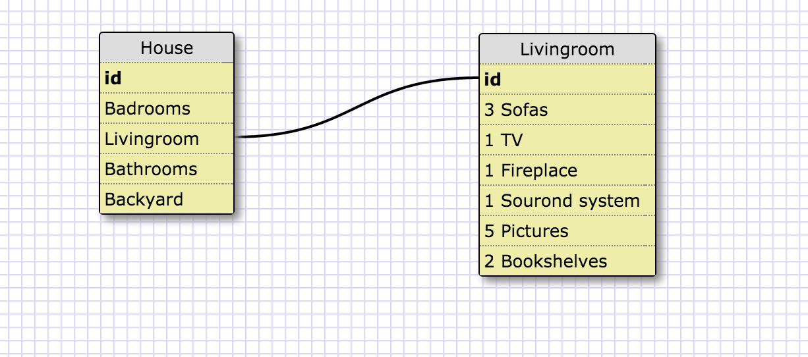

1)What is a one-to-one database?
1)One to one relationship is define that to one key have only one key that much, like in my example, every house might have many bedroom, but have only one living room( unless you're super rich and have more than 1) so for the key ‘livingroom’ there is one machine table’ living room table’

2)When would you use a one-to-one database? (Think generally, not in terms of the example you created).
2)I would use it if there is only one connection needed, and there won't be any connection that might be added in the future.

3)What is a many-to-many database?
3)Many to many database means that there is many connection between the tables, and the information. so for the same table will have 2 or more connection to other tables.

4)When would you use a many-to-many database? (Think generally, not in terms of the example you created).
4)I would uses many to many database if I see that I need to create more than one connection betweens the tables.

5)What is confusing about database schemas? What makes sense?
5)Well, to be honest, when i start doing this challenge i was sure it's super easy, and it took me a while to get the many to many racyue. It took me some time to understand the need for the third table, like it was shown in the example that the only function the table have is to connect between the two tables, but i think i got it. 

